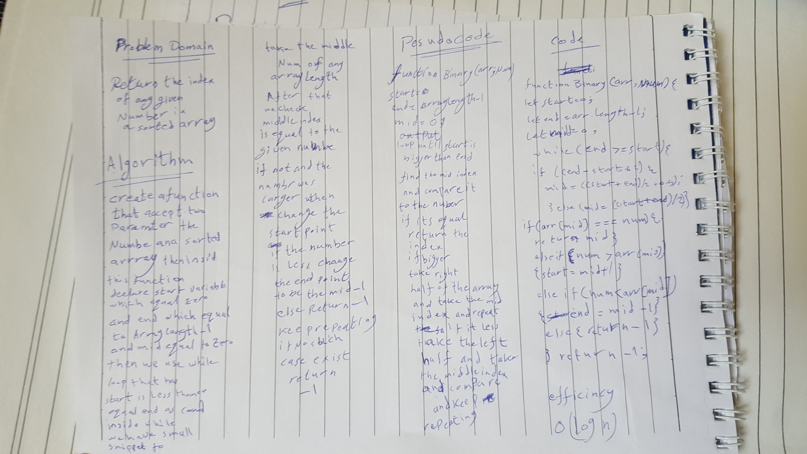

# Challenge Summary
<!-- Short summary or background information -->
return the index of any given number in a sorted array

## Challenge Description
<!-- Description of the challenge -->
in this challange we are required to use binary search algorithm to find the index of any given number that exist in the sorted array and if the nummber does not exist return -1

## Approach & Efficiency
<!-- What approach did you take? Why? What is the Big O space/time for this approach? -->
	time O(log n)
	space O(1)

## Solution
<!-- Embedded whiteboard image -->

[GA](https://github.com/Amer-401-advanced-javascript/data-structures-and-algorithms/actions)
