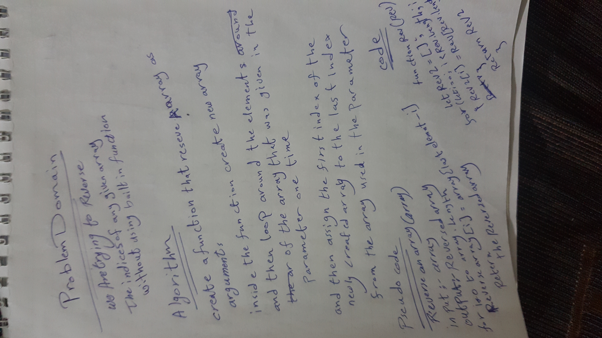

# Reverse an Array
<!-- Short summary or background information -->
reversed the array using **reverseArray** function 

## Challenge
<!-- Description of the challenge -->
Here we need to reverse the indices of any given array without using builtin function

## Approach & Efficiency
<!-- What approach did you take? Why? What is the Big O space/time for this approach? -->

## Solution
<!-- Embedded whiteboard image -->
