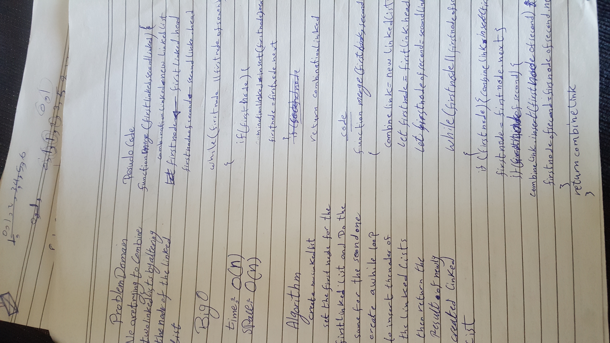

# Singly Linked List
<!-- Short summary or background information -->
linked list is a type of linear data structure used to organize data where each element is a seperate object(node)

## Challenge
<!-- Description of the challenge -->
Here we are trying to merge two linkedlist so that the nodes alternate between the first linked_list and the second linked_list

## Approach & Efficiency
<!-- What approach did you take? Why? What is the Big O space/time for this approach? -->
mergeLists() ====> time O(n), space O(n)
because the function depends on the number of inputs

## API
<!-- Description of each method publicly available to your Linked List -->
* mergeLists method used to combine two linked_lists into one

## Solution
<!-- Embedded whiteboard image -->
(ll-merge)

