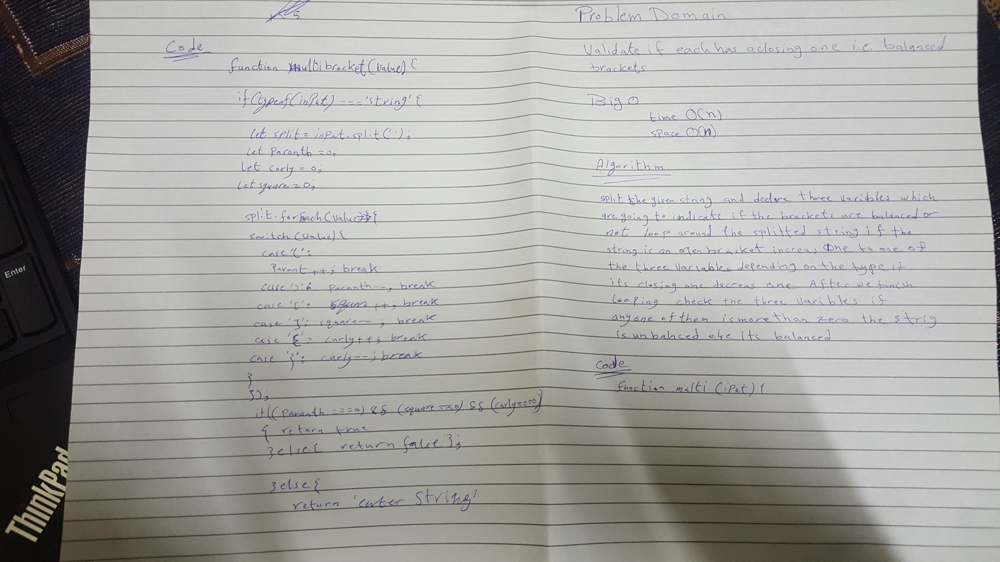

# Challenge Summary
<!-- Short summary or background information -->

## Challenge Description
<!-- Description of the challenge -->
validte if each open brackets has a closing one

## Approach & Efficiency
<!-- What approach did you take? Why? What is the Big O space/time for this approach? -->
    BigO: 
        time: O(n): the exrcution time changes linarly with the inputs number
        space: O(n): the space is increase linearly with the number of inputs through the whole operation

## Solution
<!-- Embedded whiteboard image -->
