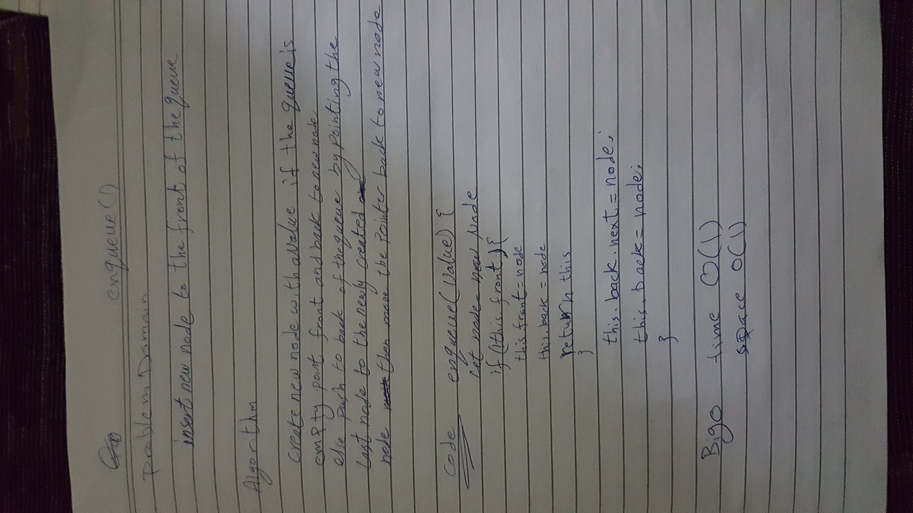

# Stacks and Queues
<!-- Short summary or background information -->
Stacks: Stack is collection of elements, that follows the LIFO order.
Queue is a data structure that follows the FIFO principle.

## Challenge
<!-- Description of the challenge -->
implement different operation a stack and queue
like pushing to stack poping peeking checking for emptiness

## Approach & Efficiency
<!-- What approach did you take? Why? What is the Big O space/time for this approach? -->
stack 
* push():
    time: O(1) the execution time doesn't change with the input becuase we are always adding to the top of the stack
    space: O(1) the number of input is constant

* pop():
    time: O(1) the execution time doesn't change with the input becuase we are always removing from the top of the stack
    space: O(1) the number of input is constant

* peek():
    time: O(1) the execution time doesn't change with the input becuase we are always entering from the top of the stack
    space: O(1) the space is not effected by the number of inputs

* isEmpty():
    time: O(1) larger stack doesn't affect the execution time
    space: O(1) 

* enqueue(): 
    time: O(1) the execution time doesn't change with the input becuase we are always adding to the front of the queue
    space: O(1) the number of input is constant

* dequeue():
    time: O(1) the execution time doesn't change with the input becuase we are always removing from the front of the queue
    space: O(1) the number of input is constant

* peek():
    time: O(1) the execution time doesn't change with the input becuase are we always entering from the front of the queue
    space: O(1) the space is not effected by the number of inputs

* isEmpty():
    time: O(1) larger queue doesn't affect the execution time
    space: O(1)
   

## API
<!-- Description of each method publicly available to your Stack and Queue-->

